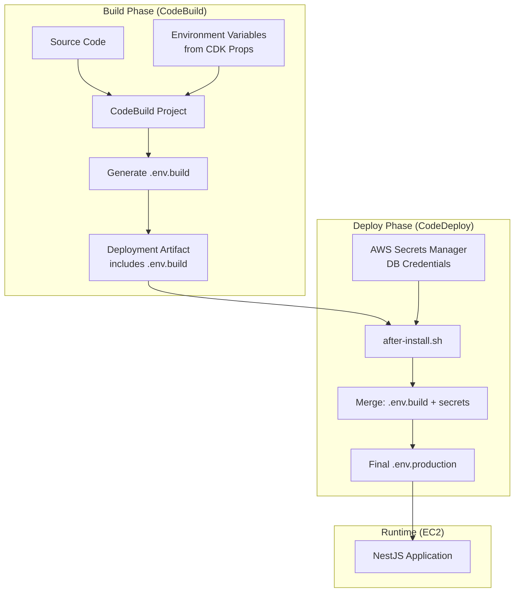

# Design Document: Build-Time Environment Configuration

## Overview

This design enables multi-environment deployment support by separating environment configuration into two categories:

1. **Build-Time Variables**: Non-sensitive configuration injected during CodeBuild (e.g., domain names, bucket names, feature flags)
2. **Runtime Secrets**: Sensitive credentials retrieved from AWS Secrets Manager during deployment (e.g., database username/password)

The current approach creates the entire `.env.production` file during EC2 initialization, which hardcodes environment-specific values. This design moves non-sensitive configuration to the build phase, allowing the same infrastructure to support multiple environments (dev, staging, production) by simply changing build-time parameters.

## Architecture



## Components and Interfaces

### 1. DeploymentStack Props Extension

The `DeploymentStackProps` interface will be extended to accept environment configuration:

```typescript
interface EnvironmentConfig {
  domainName: string;
  allowedOrigins: string;
  isCloud: boolean;
  cloudwatchLogGroupName: string;
  snsErrorTopicArn: string;
  assetsBucketName: string;
  awsRegion: string;
  // Sensitive values NOT included - retrieved at runtime
}

interface DeploymentStackProps extends StackProps {
  // ... existing props
  readonly environmentConfig: EnvironmentConfig;
}
```

### 2. CodeBuild Environment Variables

The CodeBuild project will receive environment variables from CDK:

```typescript
const buildProject = new PipelineProject(this, 'build-project', {
  environment: {
    environmentVariables: {
      DOMAIN_NAME: { value: props.environmentConfig.domainName },
      APP_ALLOWED_ORIGINS: { value: props.environmentConfig.allowedOrigins },
      APP_IS_CLOUD: { value: String(props.environmentConfig.isCloud) },
      APP_CLOUDWATCH_LOG_GROUP_NAME: { value: props.environmentConfig.cloudwatchLogGroupName },
      APP_SNS_ERROR_TOPIC_ARN: { value: props.environmentConfig.snsErrorTopicArn },
      APP_ASSETS_BUCKET_NAME: { value: props.environmentConfig.assetsBucketName },
      AWS_REGION: { value: props.environmentConfig.awsRegion },
    },
  },
});
```

### 3. Build Script (buildspec.yml)

The buildspec will generate a `.env.build` file containing build-time variables:

```yaml
phases:
  build:
    commands:
      - |
        cat > packages/api/.env.build << EOF
        NODE_ENV=production
        PORT=3000
        APP_ALLOWED_ORIGINS=${APP_ALLOWED_ORIGINS}
        APP_IS_CLOUD=${APP_IS_CLOUD}
        APP_CLOUDWATCH_LOG_GROUP_NAME=${APP_CLOUDWATCH_LOG_GROUP_NAME}
        APP_SNS_ERROR_TOPIC_ARN=${APP_SNS_ERROR_TOPIC_ARN}
        APP_ASSETS_BUCKET_NAME=${APP_ASSETS_BUCKET_NAME}
        APP_LOCAL_STORAGE_PATH=/opt/img-manager/shared/storage
        AWS_REGION=${AWS_REGION}
        DOMAIN_NAME=${DOMAIN_NAME}
        EOF
```

### 4. Deployment Script (after-install.sh)

The after-install hook will merge build-time config with runtime secrets:

```bash
#!/bin/bash
# Retrieve secrets from Secrets Manager
DB_SECRET=$(aws secretsmanager get-secret-value --secret-id $DB_SECRET_ARN --region $AWS_REGION --query SecretString --output text)
DB_USERNAME=$(echo $DB_SECRET | jq -r .username)
DB_PASSWORD=$(echo $DB_SECRET | jq -r .password)
DB_NAME=$(echo $DB_SECRET | jq -r .dbname)

# Merge build-time config with runtime secrets
cat "$APP_DIR/packages/api/.env.build" > "$SHARED_DIR/.env.production"
cat >> "$SHARED_DIR/.env.production" << EOF

# Runtime Secrets (from Secrets Manager)
DATABASE_HOST=localhost
DATABASE_PORT=5432
DATABASE_NAME=${DB_NAME}
DATABASE_USERNAME=${DB_USERNAME}
DATABASE_PASSWORD=${DB_PASSWORD}
JWT_SECRET=$(openssl rand -base64 32)
EOF

# Set secure permissions
chmod 600 "$SHARED_DIR/.env.production"
```

### 5. EC2 Init Script Changes

The EC2 init script will be simplified to:
- Create directory structure
- Retrieve and cache DB credentials for deployment scripts
- NOT create the full `.env.production` file

## Data Models

### Environment Configuration Schema

| Variable | Source | Sensitive | Description |
|----------|--------|-----------|-------------|
| NODE_ENV | Build | No | Always "production" |
| PORT | Build | No | Application port (3000) |
| APP_ALLOWED_ORIGINS | Build | No | CORS allowed origins |
| APP_IS_CLOUD | Build | No | Cloud deployment flag |
| APP_CLOUDWATCH_LOG_GROUP_NAME | Build | No | CloudWatch log group |
| APP_SNS_ERROR_TOPIC_ARN | Build | No | SNS topic for errors |
| APP_ASSETS_BUCKET_NAME | Build | No | S3 bucket for assets |
| APP_LOCAL_STORAGE_PATH | Build | No | Local storage path |
| AWS_REGION | Build | No | AWS region |
| DOMAIN_NAME | Build | No | Application domain |
| DATABASE_HOST | Runtime | No | Database host |
| DATABASE_PORT | Runtime | No | Database port |
| DATABASE_NAME | Runtime | Yes | Database name |
| DATABASE_USERNAME | Runtime | Yes | Database username |
| DATABASE_PASSWORD | Runtime | Yes | Database password |
| JWT_SECRET | Runtime | Yes | JWT signing secret |

## Correctness Properties

*A property is a characteristic or behavior that should hold true across all valid executions of a system-essentially, a formal statement about what the system should do. Properties serve as the bridge between human-readable specifications and machine-verifiable correctness guarantees.*

### Property 1: Build-time config contains all required non-sensitive variables
*For any* generated `.env.build` file, the file SHALL contain all required non-sensitive variables: APP_ALLOWED_ORIGINS, APP_IS_CLOUD, APP_CLOUDWATCH_LOG_GROUP_NAME, APP_SNS_ERROR_TOPIC_ARN, APP_ASSETS_BUCKET_NAME, AWS_REGION, DOMAIN_NAME, NODE_ENV, PORT, APP_LOCAL_STORAGE_PATH.
**Validates: Requirements 1.3**

### Property 2: Build-time config excludes sensitive credentials
*For any* generated `.env.build` file, the file SHALL NOT contain any of the following sensitive variables: DATABASE_USERNAME, DATABASE_PASSWORD, JWT_SECRET.
**Validates: Requirements 1.4**

### Property 3: Merged config contains both build-time and runtime values
*For any* valid `.env.build` file and valid Secrets Manager response, the merged `.env.production` file SHALL contain all variables from the build-time config AND all runtime secrets (DATABASE_HOST, DATABASE_PORT, DATABASE_NAME, DATABASE_USERNAME, DATABASE_PASSWORD, JWT_SECRET).
**Validates: Requirements 2.2, 5.2**

### Property 4: Final config validation passes only with complete configuration
*For any* `.env.production` file, the validation function SHALL return true if and only if the file contains all required variables (both build-time and runtime).
**Validates: Requirements 5.4**

### Property 5: CDK defaults are applied when environment config is not provided
*For any* DeploymentStack instantiation where optional environment config values are not provided, the stack SHALL use sensible default values that enable local development.
**Validates: Requirements 4.3**

## Error Handling

### Build Phase Errors
- **Missing environment variables**: CodeBuild will fail if required environment variables are not set in CDK
- **Invalid variable values**: Build script validates variable format before generating `.env.build`

### Deployment Phase Errors
- **Secrets Manager access failure**: Deployment fails with clear error message, triggers rollback
- **Missing `.env.build` file**: Deployment fails if build artifact doesn't contain the config file
- **Merge failure**: Deployment fails if unable to write merged config file
- **Validation failure**: Deployment fails if merged config is missing required variables

### Error Response Format
```bash
# Example error handling in after-install.sh
if [ ! -f "$APP_DIR/packages/api/.env.build" ]; then
    echo "[$(date)] ✗ ERROR: .env.build not found in deployment artifact"
    exit 1
fi

if ! aws secretsmanager get-secret-value --secret-id "$DB_SECRET_ARN" --region "$AWS_REGION" > /dev/null 2>&1; then
    echo "[$(date)] ✗ ERROR: Failed to retrieve database credentials from Secrets Manager"
    exit 1
fi
```

## Testing Strategy

### Dual Testing Approach

This feature requires both unit tests and property-based tests to ensure correctness:

#### Unit Tests
Unit tests will verify specific examples and edge cases:
- Build script generates valid `.env.build` file with expected content
- Deployment script correctly retrieves secrets from Secrets Manager
- File permissions are set correctly (600)
- Error handling works for missing files and failed API calls

#### Property-Based Testing
Property-based tests will verify universal properties using **fast-check** library for TypeScript:

1. **Config Generation Property**: For any valid set of environment variables, the generated `.env.build` file contains exactly those variables and no sensitive data
2. **Config Merge Property**: For any valid build config and secrets, the merged config contains all values from both sources
3. **Validation Property**: For any config file, validation passes iff all required variables are present

#### Test File Structure
```
infrastructure/
  lib/
    __tests__/
      env-config.test.ts        # Unit tests for CDK config
      env-config.property.ts    # Property-based tests
deploy/
  __tests__/
    env-merge.test.sh           # Shell script tests
```

#### Property Test Configuration
- Minimum 100 iterations per property test
- Each test tagged with format: `**Feature: build-time-env-config, Property {number}: {property_text}**`
